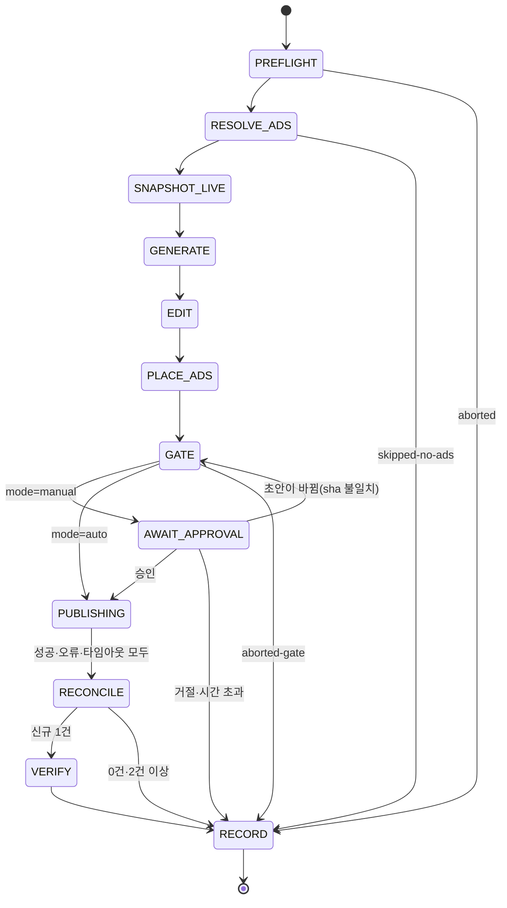

# 자동 포스터 로봇 구현 설계

> **목적**: `documents/23-auto-poster-robot-plan.md`(이하 **계획**)의 Phase 1–3을 바로 구현할 수 있는 수준으로 모듈·데이터·API 계약·상태 전이·구동 방법을 확정한다. Phase 4(쿠팡 Open API)는 교체 지점만 정한다.
> **작성**: 2026-09-15 / **상태**: 설계(미구현)
> **규칙의 출처**: 발행 규칙은 `.omp/skills/naver-blog-cycle/SKILL.md`(이하 **스킬**)에서 가져와 `src/robot/policies.ts` 상수로 옮긴다. 옮긴 뒤에는 코드가 단일 출처다.

---

## 0. 설계 전제 (실측 2026-09-15 21:30 KST)

| 항목                 | 실측                                                                                                                                                                                                                                                                       | 설계 반영                                                                                                                      |
| -------------------- | -------------------------------------------------------------------------------------------------------------------------------------------------------------------------------------------------------------------------------------------------------------------------- | ------------------------------------------------------------------------------------------------------------------------------ |
| 웹 서버 미기동       | macOS 27 업데이트 재부팅(가동 1시간 21분) 뒤 PM2 앱 0개, 3002 포트 미수신. `~/.pm2/dump.pm2`에는 `blog-auto-poster-web`(PORT=3002)이 저장돼 있지만 `pm2 startup` launch agent가 없어서 부팅 후 자동 기동되지 않았다                                                        | §7-1 부팅 자동 기동, §7-5 장애 대응                                                                                            |
| 대시보드 인증 기본값 | `web.jwtSecret`이 어떤 설정 파일에도 없어 코드 기본값 `change-me-in-production`을 쓴다(`src/web/server/index.ts:141`). 관리자 계정 env가 없어 `admin`/`changeme`로 로그인된다(`src/web/server/middleware/auth.ts:81-82`). 바인딩은 `0.0.0.0`이다(`scripts/start-web.js:8`) | **로봇 가동 전 필수 교체**(§7-1 0단계). 지금은 같은 네트워크의 누구나 로그인하거나 토큰을 위조해 발행 API를 부를 수 있다       |
| env 매핑 누락        | README는 `BLOG_POSTER_WEB_JWT_SECRET`을 안내하지만 `ConfigManagerImpl.applyEnvOverrides`(`src/core/config.ts:153`)에 매핑이 없다                                                                                                                                           | JWT 비밀값은 `config/secrets.yaml`의 `web.jwtSecret`에 둔다. README 문구는 PR4에서 고친다                                      |
| LLM                  | `llm.provider=deepseek`(OpenAI 호환 클라이언트, JSON 모드 사용 `src/content/ContentGenerator.ts:476-499`)                                                                                                                                                                  | 판단(Judge)은 같은 설정을 재사용한다. 이미지 입력 지원 여부는 확인하지 못했으므로 이미지 적합성 판정은 설정으로 분리한다(§5-3) |
| 쿠팡                 | 파트너스 최종 승인 전, API 비활성                                                                                                                                                                                                                                          | 소재는 반자동 붙여넣기(계획 §3-1-1)                                                                                            |
| 런타임               | Node v26.7.0, PM2 7.0.4, `better-sqlite3` 로드 정상                                                                                                                                                                                                                        | —                                                                                                                              |

---

## 1. 구성 요소와 파일

```
src/
├── content/                      # 기존 @content — 광고 순수 모듈 추가 (web·robot 공용, 네트워크·DB·fs 없음)
│   ├── AdTypes.ts                # AdItem, AdPolicy, AdSlot, GateViolation
│   ├── AdMatcher.ts              # matchAds()
│   ├── AdPlacement.ts            # planAdSlots(), stripAutoAds()
│   ├── Disclosure.ts             # DISCLOSURE_TEXT, ensureDisclosure(), countDisclosures()
│   └── AdGate.ts                 # checkAdGate() (구조), checkAdLinks() (fetcher 주입)
├── affiliates/
│   └── AdInventory.ts            # ad_inventory / ad_requests 저장소 (web 전용)
├── platforms/naver/
│   └── NaverRss.ts               # parseNaverRss·findRecentlyPublishedRssItem 이동 (NaverBrowserPoster는 재export)
├── robot/                        # 신규 — 상주 프로세스
│   ├── index.ts                  # 데몬 엔트리: 설정 로드 → 리스 획득 → 스케줄 틱 → 명령 폴링 → 종료 처리
│   ├── cli.ts                    # status / once / approve / reject / pause / resume / cancel / adopt / doctor
│   ├── RobotStore.ts             # data/robot.sqlite
│   ├── RobotScheduler.ts         # 주간 슬롯 계산, 놓친 슬롯 보정, 지터
│   ├── RobotRunner.ts            # 상태 머신 드라이버, 크래시 복구
│   ├── DashboardClient.ts        # web REST 클라이언트 (로그인·재시도 정책)
│   ├── Judge.ts                  # LLM 판단 (구조화 JSON + 검증)
│   ├── policies.ts               # 스킬 규칙 상수·순수 판정 함수
│   ├── evidence.ts               # data/ops/runs/<runId>/, publish-log.jsonl
│   ├── keepAwake.ts              # caffeinate 어서션
│   ├── notify.ts                 # macOS 알림
│   ├── imageProbe.ts             # PNG/JPEG 헤더로 손상·크기 확인 (의존성 추가 없음)
│   └── steps/                    # 단계별 1파일 (§5-1)
└── web/server/routes/
    ├── ads.ts                    # 신규 라우트 파일 (routes/index.ts 1,944줄 비대화 방지)
    └── robot.ts                  # 신규 — robot.sqlite 읽기 + 명령 쓰기
ecosystem.config.cjs              # 신규 — PM2 앱 2개 정의
```

**import 규칙**

| 로봇이 import 해도 되는 것                                                                                         | 금지(상태 변경은 API로만)                                                                           |
| ------------------------------------------------------------------------------------------------------------------ | --------------------------------------------------------------------------------------------------- |
| `@core/logger`, `@core/config`, `@content/Ad*`, `@content/linkInput`, `@intelligence/TrendAnalysis`, `NaverRss.ts` | `@content/postStorage`(파일 쓰기), `NaverAdapter`/`NaverBrowserPoster`(브라우저 프로필), `JobQueue` |

`NaverRss.ts` 분리 이유: RSS 순수 함수가 `NaverBrowserPoster.ts`에 있어서 import하면 파일 첫머리의 `playwright` 의존까지 로봇에 딸려 온다(`NaverBrowserPoster.ts:5`).

---

## 2. 데이터

### 2-1. `data/blog-auto-poster.db` — web 소유

기존 `ShoppingCategoryStore`와 같은 DB·같은 설정(WAL, `busy_timeout = 5000`)을 쓴다.

```sql
CREATE TABLE IF NOT EXISTS ad_inventory (
  id TEXT PRIMARY KEY,                    -- ad-<epoch>-<rand>
  source TEXT NOT NULL,                   -- manual | api
  kind TEXT NOT NULL DEFAULT 'product-link',
  product_name TEXT NOT NULL,
  url TEXT NOT NULL UNIQUE,               -- https://link.coupang.com/a/<code>
  image_url TEXT,
  keywords TEXT NOT NULL,                 -- JSON 배열, 정규화 전 원문
  category_id TEXT,
  request_id TEXT,                        -- 소재 요청으로 등록됐으면 연결
  status TEXT NOT NULL DEFAULT 'active',  -- active | dead | expired | removed
  last_checked_at TEXT,
  last_check_result TEXT,                 -- JSON {status, location}
  used_count INTEGER NOT NULL DEFAULT 0,
  last_used_at TEXT,
  expires_at TEXT,                        -- api 소스만
  created_at TEXT NOT NULL,
  updated_at TEXT NOT NULL
);

CREATE TABLE IF NOT EXISTS ad_requests (
  id TEXT PRIMARY KEY,                    -- req-<epoch>-<rand>
  robot_run_id TEXT,                      -- 로봇 기획 실행 id (수동 생성이면 NULL)
  keyword TEXT NOT NULL,
  category_id TEXT,
  needed INTEGER NOT NULL,
  criteria TEXT NOT NULL,                 -- JSON 배열: 상품 고르는 기준 (예: "안감 있는 울 혼방")
  due_at TEXT NOT NULL,                   -- 발행 예정 슬롯
  status TEXT NOT NULL,                   -- open | fulfilled | expired | cancelled
  created_at TEXT NOT NULL,
  updated_at TEXT NOT NULL
);
CREATE INDEX IF NOT EXISTS idx_ad_inventory_category ON ad_inventory(category_id, status);
CREATE INDEX IF NOT EXISTS idx_ad_requests_status ON ad_requests(status, due_at);
```

- `url` UNIQUE: 같은 링크를 두 번 붙여넣으면 키워드만 병합한다.
- 기존 `data/link-presets.json`(현재 없음)은 첫 기동 시 있으면 `ad_inventory`로 옮기고 파일 이름을 `.migrated`로 바꾼다.

### 2-2. `data/robot.sqlite` — robot 소유

```sql
CREATE TABLE IF NOT EXISTS robot_runs (
  id TEXT PRIMARY KEY,                    -- 20260922T211000+0900-publish
  kind TEXT NOT NULL,                     -- plan | publish
  slot TEXT NOT NULL,                     -- 예정 슬롯 ISO(+09:00) 또는 manual-<epoch>
  trigger TEXT NOT NULL,                  -- schedule | catch-up | manual
  mode TEXT NOT NULL,                     -- manual | auto (시작 시점 스냅샷)
  status TEXT NOT NULL,                   -- running | waiting | done | skipped | aborted
  step TEXT NOT NULL,
  plan_id TEXT,
  keyword TEXT,
  category_id TEXT,
  draft_id TEXT,
  preview_sha256 TEXT,
  approval_requested_at TEXT,
  publish_started_at TEXT,                -- PUBLISHING 진입 시각 (크래시 복구 판단용)
  log_no TEXT,
  url TEXT,
  outcome TEXT,
  warnings TEXT,                          -- JSON 배열
  code_version TEXT,                      -- git rev-parse HEAD (+dirty)
  started_at TEXT NOT NULL,
  updated_at TEXT NOT NULL,
  finished_at TEXT,
  UNIQUE (kind, slot)                     -- 슬롯당 실행 1개: 재시작·보정 실행이 겹쳐도 중복 생성 불가
);

CREATE TABLE IF NOT EXISTS robot_steps (
  id INTEGER PRIMARY KEY AUTOINCREMENT,
  run_id TEXT NOT NULL REFERENCES robot_runs(id),
  step TEXT NOT NULL,
  attempt INTEGER NOT NULL,
  status TEXT NOT NULL,                   -- started | ok | failed | waiting
  detail TEXT,                            -- JSON (토큰·쿠키·키 값 금지)
  started_at TEXT NOT NULL,
  finished_at TEXT
);

CREATE TABLE IF NOT EXISTS robot_plans (
  id TEXT PRIMARY KEY,
  run_id TEXT NOT NULL,
  keyword TEXT NOT NULL,
  category_id TEXT,
  decision TEXT NOT NULL,                 -- JSON: 후보·수치·탈락 사유·선정 근거
  publish_slot TEXT NOT NULL,             -- 이 계획을 소비할 발행 슬롯
  ad_request_id TEXT,
  status TEXT NOT NULL,                   -- planned | consumed | carried | expired
  created_at TEXT NOT NULL
);

CREATE TABLE IF NOT EXISTS robot_commands (
  id INTEGER PRIMARY KEY AUTOINCREMENT,
  type TEXT NOT NULL,                     -- approve | reject | pause | resume | run-now | cancel | adopt
  run_id TEXT,
  payload TEXT,                           -- JSON (approve: {previewSha256}, adopt: {logNo}, run-now: {kind, until})
  source TEXT NOT NULL,                   -- dashboard | cli
  status TEXT NOT NULL DEFAULT 'pending', -- pending | applied | refused
  result TEXT,
  created_at TEXT NOT NULL,
  applied_at TEXT
);

CREATE TABLE IF NOT EXISTS robot_state (
  key TEXT PRIMARY KEY,                   -- lease | paused | consecutive_pass
  value TEXT NOT NULL,
  updated_at TEXT NOT NULL
);
```

**접근 권한**

| 테이블                   | robot 프로세스 | web 서버 | CLI (`npm run robot`) |
| ------------------------ | -------------- | -------- | --------------------- |
| `robot_runs/steps/plans` | 쓰기           | 읽기     | 읽기                  |
| `robot_commands`         | 상태 갱신      | INSERT만 | INSERT만              |
| `robot_state`            | 쓰기           | 읽기     | 읽기                  |
| `ad_inventory/requests`  | API로만        | 쓰기     | —                     |

web은 로봇이 한 번도 돌지 않아 `robot.sqlite`가 없으면 `/api/robot/status`에 `installed: false`를 돌려준다.

### 2-3. 증거 파일

스킬 §10의 `data/ops/runs/<runId>/` 구조와 `data/ops/publish-log.jsonl` 한 줄 규약을 그대로 쓴다. 추가 파일은 두 개다.

- `robot/steps.json`: `robot_steps` 덤프
- `ads/placement.json`: 슬롯·상품·게이트 결과

`rulesHash` 필드는 `code_version`(커밋 해시)으로 대체한다. 규칙이 코드로 옮겨 왔기 때문이다.

---

## 3. 광고 모듈 (순수)

### 3-1. 타입

```ts
// src/content/AdTypes.ts
export interface AdItem {
  id: string;
  source: 'manual' | 'api';
  productName: string;
  url: string;
  imageUrl?: string;
  keywords: string[];
  categoryId?: string;
  status: 'active' | 'dead' | 'expired' | 'removed';
  lastCheckedAt?: string;
  usedCount: number;
}

export interface AdPolicy {
  minAds: number; // 2 — 글 1건에 필요한 최소 상품 수
  maxBlocks: number; // 4
  minBlocks: number; // 2
  firstAfterSection: number; // 2 — 두 번째 h2 섹션 끝부터 배치 후보
  minSectionGap: number; // 2
  bundleSize: [min: number, max: number]; // [2, 3]
  showPrice: boolean; // false
}

export interface RankedAd {
  ad: AdItem;
  score: number;
  matchedBy: 'keyword' | 'category';
}

export interface AdSlot {
  kind: 'single' | 'bundle';
  afterSection: number; // 1-based h2 순번
  sectionTitle: string;
  adIds: string[];
}

export interface GateViolation {
  code: string;
  message: string;
  detail?: unknown;
}
```

### 3-2. `matchAds(topic, inventory, now, policy): RankedAd[]`

1. `normalizeKeyword(s)` = 소문자 → 공백·특수문자 제거. `트위드 자켓`과 `트위드자켓`은 같다.
2. `status === 'active'`이고 `expiresAt`이 지나지 않은 소재만 대상으로 한다.
3. 점수:
   - 키워드 완전 일치 100
   - 소재 키워드가 주제 키워드를 포함하거나 그 반대 70
   - 카테고리 일치 40, 조상 카테고리 일치 25
   - 모두 0이면 제외한다.
4. 동점이면 `usedCount`가 적은 순, 그다음 `createdAt`이 최근인 순. 같은 상품만 반복 노출되는 것을 막는다.
5. 결과는 점수 내림차순. `minAds` 미만이면 호출부가 `skipped-no-ads`로 처리한다. 이 함수는 개수로 실패를 판정하지 않는다.

### 3-3. `planAdSlots(html, ranked, policy): { html, slots, notes }`

결정적 알고리즘이다. 같은 입력이면 항상 같은 결과를 낸다.

1. `stripAutoAds(html)`로 이전 자동 광고(`data-ad-source="auto"`)와 자동 고지를 먼저 지운다. 여러 번 호출해도 결과가 같다.
2. 문서 순서대로 `h2` 목록을 모아 섹션 n개를 만든다(템플릿은 `h2`를 감싸는 `div` 안에 두므로 중첩 깊이는 따지지 않는다. 섹션 끝 = 다음 `h2` 직전). `h2`가 없으면 `h3`를 쓴다. 둘 다 없으면 본문 끝에 묶음 1개만 둔다.
3. **하단 앵커**: 제목이 `/자주\s*묻는|FAQ|Q&A/i`인 첫 섹션 f의 **직전 섹션 끝**. 없으면 마지막 섹션 끝.
4. **단일 광고 후보** = `firstAfterSection ≤ i ≤ f-2`인 섹션 i의 끝. 단, 다음 섹션은 제외한다.
   - 제목이 `/참고|출처|자료|관련\s*글/`인 섹션
   - 마지막 블록이 `img`/`figure`인 섹션(이미지 바로 뒤 광고 금지)
5. 블록 수: `blocks = clamp(floor(n / 3), minBlocks, maxBlocks)`, 단일 광고 수 `s = blocks - 1`, 묶음은 1개.
6. 상품 배분: 상위 `s`개는 단일 광고에, 다음 `bundleSize` 범위만큼은 묶음에 넣는다.
   - 묶음에 줄 상품이 `bundleSize[0]`보다 적으면 `s`를 1씩 줄여 묶음에 넘긴다.
   - 그래도 모자라면 남은 상품을 전부 단일 광고로 두고 묶음은 만들지 않는다.
7. 단일 광고 위치: `j = 0..s-1`마다 `candidates[round((j + 1) × len / (s + 1)) - 1]`을 고른다.
8. 간격 검사: 광고끼리, 그리고 하단 앵커와의 섹션 간격이 `minSectionGap`보다 작은 단일 광고는 버리고 그 상품은 묶음으로 넘긴다(최대 `bundleSize[1]`).
9. 뒤에서부터 삽입해 오프셋이 밀리지 않게 한다. 마지막에 `liftWidgetMarkers`를 적용한다.

**#25 초안(`output/posts/post-1789392253728-3a9qu/post.html`, h2 10개)에 적용한 결과**

- n=10 → blocks=3 → 단일 광고 2개 + 묶음 1개
- f=10("자주 묻는 질문") → 하단 앵커는 §9 "구매 전 마지막 점검"의 끝
- 후보: §2, §3, §4, §5, §7, §8 (§6 "참고하면 좋은 공개 자료" 제외)
- j=0 → `candidates[1]` = §3, j=1 → `candidates[3]` = §5. 간격은 §3–§5 = 2, §5–§9 = 4로 통과
- **결과: §3 뒤 단일 · §5 뒤 단일 · §9 뒤 묶음(2–3개)**. 이 결과를 유닛 테스트 기대값으로 고정한다.
- 설계 시점에 같은 규칙을 초안에 직접 실행해 후보 `[2,3,4,5,7,8]`, 선택 `[3,5]`를 확인했다. 이미지는 섹션 중간에 있어서 제외된 섹션이 없었다.

### 3-4. 마커와 렌더링 — 미리보기와 발행본을 같게

```html
<div
  data-coupang-widget="product-link"
  data-ad-source="auto"
  data-ad-id="ad-1789…"
  data-ad-slot-kind="single"
  data-widget-props="%7B%22url%22%3A…%2C%22text%22%3A…%2C%22imageUrl%22%3A…%7D"
></div>
```

- 묶음은 `data-ad-slot-kind="bundle"` 마커 N개를 연속으로 두고, 앞에 고정 문구 문단 `<p data-ad-source="auto">함께 비교해 볼 만한 상품</p>`을 둔다. LLM이 쓴 연결 문장은 v1에서 넣지 않는다(정직성 게이트 부담을 없앤다).
- **`data-ad-source="auto"` 마커는 발행할 때 네트워크를 조회하지 않는다.** `expandCoupangWidgetsReport`가 인벤토리에 저장된 props(url·상품명·이미지)만으로 `buildProductPreviewCard`를 만든다.
  - 현재 발행 경로는 `fetchLinkPreviewCards`로 발행 순간 상품 페이지를 조회해 카드를 만든다(`src/web/server/routes/index.ts:1452`). 이러면 미리보기와 발행본이 달라진다.
  - 따라서 자동 광고는 이 조회에서 제외하고, `publish-preview`도 같은 오프라인 렌더를 쓴다.
- 가격·평점은 `showPrice=false`면 렌더하지 않는다.

### 3-5. `ensureDisclosure(html, hasAds)`

- `DISCLOSURE_TEXT = '이 포스팅은 쿠팡 파트너스 활동의 일환으로, 이에 따른 일정액의 수수료를 제공받습니다.'`를 `Disclosure.ts` 한 곳에만 둔다.
  - 템플릿 6종의 두 가지 문구(상단 "…제공받을 수 있습니다", 하단 `<small>`)는 템플릿에서 `{{> disclosure}}` partial로 바꾸거나 제거한다.
  - `PublishedPostInspector.ts:72`의 `DISCLOSURE_TEXT = '쿠팡 파트너스'`는 이 상수를 import한다.
- 동작:
  1. 텍스트가 `/쿠팡\s*파트너스\s*활동/`인 블록을 모두 제거한다(템플릿 기본 고지 포함).
  2. `hasAds`면 본문 **첫 블록** 앞에 `<p data-ad-source="auto" data-ad-disclosure style="…">` 1개를 삽입한다.
- 결과적으로 고지는 광고가 있으면 정확히 1회(상단), 없으면 0회다.

### 3-6. `checkAdGate(html, expected, policy): GateViolation[]`

| code                  | 조건                                                                                            |
| --------------------- | ----------------------------------------------------------------------------------------------- |
| `AD_COUNT`            | 자동 광고 블록 수가 `expected.slots`와 다름, 또는 상품 수 < `minAds`                            |
| `DISCLOSURE_COUNT`    | 광고 ≥ 1인데 고지 ≠ 1, 또는 광고 0인데 고지 > 0                                                 |
| `DISCLOSURE_POSITION` | 고지가 최상위 블록 기준 3번째보다 뒤                                                            |
| `AD_IN_TRAP`          | 광고 마커가 `figure,figcaption,p,li,ul,ol,blockquote,table` 안에 있음                           |
| `AD_ADJACENT`         | 두 광고 블록 사이에 `h2`/`h3`가 없음(묶음 내부는 예외)                                          |
| `AD_AFTER_IMAGE`      | 광고 블록 바로 앞 형제가 `img`/`figure`                                                         |
| `AD_URL_HOST`         | url이 `https://link.coupang.com/a/` 또는 `https://www.coupang.com/vp/products/`로 시작하지 않음 |
| `AD_IMAGE_URL`        | imageUrl이 https가 아님                                                                         |
| `AD_UNKNOWN_ID`       | `data-ad-id`가 인벤토리에 없거나 `active`가 아님                                                |
| `LEFTOVER_MARKER`     | `data-ad-slot`(템플릿 슬롯) 잔존, iframe/script 존재                                            |
| `FORBIDDEN_TEXT`      | 자동 문구에 `policies.FORBIDDEN_PATTERNS`(1인칭 체험·스텁·근거 없는 가격 단정) 일치             |

### 3-7. `checkAdLinks(ads, fetcher)` — 네트워크, 최소 호출

- 광고 1개당 요청 1회, **첫 리다이렉트만 본다**(`redirect: 'manual'`). 3xx이고 `Location` 호스트가 `coupang.com`이면 통과한다. 상품 페이지까지 따라가지 않는다.
- 발행 실행의 `GATE`에서 1회만 호출한다. 글 1건에 광고 4–5개, 주 2회면 주 10회 이내다. 이 요청이 파트너스 클릭으로 집계될 수 있으므로 반복 호출하지 않는다.
- 결과는 `ad_inventory.last_checked_at/last_check_result`에 저장한다. 4xx이거나 쿠팡 밖으로 리다이렉트되면 `status='dead'`로 바꾸고 해당 광고를 슬롯에서 뺀 뒤 `PLACE_ADS`부터 다시 한다(최대 1회).

---

## 4. web 서버 변경 (API 계약)

### 4-1. 엔드포인트

| 메서드·경로                         | 요청                                                             | 응답                                                                                                 | 비고                                                                                            |
| ----------------------------------- | ---------------------------------------------------------------- | ---------------------------------------------------------------------------------------------------- | ----------------------------------------------------------------------------------------------- |
| `GET /health`                       | —                                                                | 기존 + `services.naverSession: {expiresAt, daysLeft}`                                                | 프로필 `Cookies` DB를 읽기 전용으로 열어 `NID_SES`·`NID_AUT` 만료를 읽는다(스킬 S0과 같은 쿼리) |
| `GET /api/ads/inventory`            | `?keyword&categoryId&status`                                     | `{items: AdItem[]}`                                                                                  | `keyword`가 있으면 `matchAds` 순서로 정렬해 돌려준다                                            |
| `POST /api/ads/inventory`           | `{paste, keywords[], categoryId?, requestId?}`                   | `{item}` / 400 `{error, field}`                                                                      | `parseLinkInput(paste)`로 url·imageUrl·alt 추출. url 형식 불일치면 400                          |
| `PATCH /api/ads/inventory/:id`      | `{keywords?, categoryId?, status?}`                              | `{item}`                                                                                             |                                                                                                 |
| `DELETE /api/ads/inventory/:id`     | —                                                                | `{ok}`                                                                                               | `status='removed'` 소프트 삭제(발행된 글의 추적용)                                              |
| `GET /api/ads/requests`             | `?status=open`                                                   | `{requests, inventoryCounts}`                                                                        |                                                                                                 |
| `POST /api/ads/requests`            | `{keyword, categoryId?, needed, criteria[], dueAt, robotRunId?}` | `{request}`                                                                                          | 같은 keyword의 open 요청이 있으면 그 요청을 갱신한다(멱등)                                      |
| `POST /api/ads/requests/:id/cancel` | —                                                                | `{ok}`                                                                                               |                                                                                                 |
| `PUT /api/posts/:id`                | 기존 + `tags?: string[]`                                         | 기존                                                                                                 | 현재는 title·content만 저장된다(`routes/index.ts:1163`)                                         |
| `POST /api/posts/:id/place-ads`     | `{keyword, categoryId?, policy?}`                                | `{html, slots, ads, disclosure: boolean, notes}`                                                     | `matchAds` → `planAdSlots` → `ensureDisclosure` 결과를 `post.html`에 저장. 멱등                 |
| `POST /api/posts/:id/gate`          | `{expectedSlots, checkLinks: boolean}`                           | `{ok, violations, previewSha256, previewHtmlPath}`                                                   | 구조 게이트 + 런북 백로그 ④ 구조 검사 + (선택) 링크 검사. 파일을 바꾸지 않는다                  |
| `POST /api/posts/:id/publish`       | 기존 + `{strict: true, expectedPreviewSha256, robotRunId}`       | 기존 / 오류 §4-2                                                                                     | `strict`가 없으면 기존 동작 그대로(수동 발행 호환)                                              |
| `GET /api/robot/status`             | —                                                                | `{installed, lease, paused, mode, nextSlots, current, awaitingApproval, recent[10], openAdRequests}` | robot.sqlite 읽기 전용                                                                          |
| `GET /api/robot/runs/:id`           | —                                                                | `{run, steps, plan, evidenceDir}`                                                                    |                                                                                                 |
| `POST /api/robot/commands`          | `{type, runId?, payload?}`                                       | `{commandId}`                                                                                        | 검증은 로봇이 적용 시점에 한다(`status=refused`, `result`에 사유)                               |

### 4-2. `strict` 발행 흐름

```
1. publishLock 획득 (프로세스 내 뮤텍스)            → 실패: 423 PUBLISH_IN_PROGRESS
2. post.html 로드 → buildPublishPreviewHtml → sha256  → 불일치: 409 PREVIEW_CHANGED
3. 중복 검사
   a. published_posts에 같은 draftId가 24h 안에 status=published → 409 DUPLICATE_DRAFT
   b. RSS 제목 정규화 일치(180일)                                   → 409 DUPLICATE_TITLE
4. checkAdGate + 구조 게이트 재실행(링크 검사 제외)                 → 위반: 422 GATE_FAILED {violations}
5. aiPolish 무시(요청에 true가 있으면 400), 프리셋 배치·CTA 채우기 생략 — 파일을 바꾸지 않는다
6. 위젯 확장: 자동 광고는 오프라인 카드(§3-4), 그 외는 기존 경로
7. adapter.createPost → recordPublishedPost(metadata에 robotRunId, previewSha256)
8. publishLock 해제 (finally)
```

- 클라이언트(로봇)가 연결을 끊어도 Fastify 핸들러는 끝까지 실행된다. 로봇은 결과를 응답이 아니라 RSS로 확정한다(§5-1 `RECONCILE`).
- `strict`가 없는 기존 수동 발행에도 1번(뮤텍스)과 3a(24h 중복)는 적용한다. 로봇과 사람이 동시에 발행하는 경우를 막기 위해서다.

---

## 5. 로봇 내부

### 5-1. 상태 머신

```ts
// src/robot/RobotRunner.ts
export type RunKind = 'plan' | 'publish';
export type Step =
  | 'PREFLIGHT'
  | 'SNAPSHOT_LIVE'
  | 'RESEARCH'
  | 'SELECT_TOPIC'
  | 'REQUEST_ADS'
  | 'RESOLVE_ADS'
  | 'GENERATE'
  | 'EDIT'
  | 'PLACE_ADS'
  | 'GATE'
  | 'AWAIT_APPROVAL'
  | 'PUBLISHING'
  | 'RECONCILE'
  | 'VERIFY'
  | 'RECORD';

export type StepResult =
  | { type: 'next'; step: Step; patch?: Partial<RunRow> }
  | { type: 'wait'; recheckAfterMs: number; reason: string; patch?: Partial<RunRow> }
  | { type: 'finish'; outcome: Outcome; patch?: Partial<RunRow> };

export interface StepContext {
  run: RunRow;
  config: RobotConfig;
  api: DashboardClient;
  judge: Judge;
  store: RobotStore;
  evidence: EvidenceWriter;
  clock: Clock; // 테스트에서 가짜 시계 주입
  commands: CommandInbox; // 이 실행에 해당하는 명령만
  signal: AbortSignal; // 종료 신호
}
export type StepHandler = (ctx: StepContext) => Promise<StepResult>;
```

**드라이버 규칙**

1. 단계 실행 전에 `robot_runs.step`과 `robot_steps(started)`를 커밋한다.
2. 핸들러가 `RobotAbort(reason)`를 던지면 `finish(aborted-<reason>)`로 처리한다.
3. `TransientError`(로컬 web 서버 연결 실패·5xx)는 같은 단계를 30초·2분·5분 간격으로 최대 3회 재시도한다. 단 `PUBLISHING`은 재시도하지 않고 `RECONCILE`로 간다.
4. 그 밖의 예외는 `aborted-internal`로 처리하고 스택은 로그에만 남긴다.
5. `finish`가 나오면 `RECORD`를 최선 노력으로 실행한 뒤 `status`를 확정한다(`done`/`skipped`/`aborted`).
6. `wait`가 나오면 `status='waiting'`으로 두고, 스케줄 틱마다 다시 호출한다. 프로세스를 붙잡고 기다리지 않는다.

**발행 실행 전이**



**기획 실행 단계** (월·목 21:00)

| 단계            | 호출·동작                                                                                                                                                                             | 산출                                                      | 실패                                  |
| --------------- | ------------------------------------------------------------------------------------------------------------------------------------------------------------------------------------- | --------------------------------------------------------- | ------------------------------------- |
| `PREFLIGHT`     | `GET /health`(naver true·scheduler stopped·`naverSession.daysLeft ≥ 14`), 로그인, `paused` 확인                                                                                       | —                                                         | `aborted-health`/`-login`/`-session`  |
| `SNAPSHOT_LIVE` | RSS·PostList 원문 저장, 최근 365일 제목·logNo·pubDate 목록                                                                                                                            | `live/rss-before.xml`, `live/list-before.html`            | `aborted-live`                        |
| `RESEARCH`      | `robot.categories`마다 `GET /api/keywords/category-overview`(8주·week) → 상위 키워드 5개 → `POST /api/keywords/trend`(5개씩 묶음, 16주·week) → `GET /api/keywords/:kw/blogs` sim·date | `keyword/candidates.json`, `trend-*.json`, `blogs-*.json` | `aborted-research` (추정치 대체 금지) |
| `SELECT_TOPIC`  | `policies.filterCandidates`(§5-4) → `judge.judgeTopics` → `policies.rankTopics`(수요 점수 + 소재 보유 가점)                                                                           | `keyword/decision.md`, `robot_plans` 행                   | 후보 0 → `skipped-no-candidate`       |
| `REQUEST_ADS`   | `GET /api/ads/inventory?keyword&categoryId` → `minAds` 미만이면 `POST /api/ads/requests`(needed = `minAds + 2 - 보유`, criteria = Judge가 준 기준 3개) + 알림                         | `robot_plans.ad_request_id`                               | —                                     |

결과: `planned`(소재 충분) / `planned-needs-ads`(요청 생성).

**발행 실행 단계** (화·토 21:10)

| 단계             | 호출·동작                                                                                                                                                                                                   | 멱등 기준                                     | 실패                                                                            |
| ---------------- | ----------------------------------------------------------------------------------------------------------------------------------------------------------------------------------------------------------- | --------------------------------------------- | ------------------------------------------------------------------------------- |
| `PREFLIGHT`      | 기획과 동일 + 주간 상한(§5-4) + 직전 발행 카테고리 + 이미지 예산(`output/images/.image-usage.json` 읽기)                                                                                                    | —                                             | `aborted-*`, 상한이면 `skipped-weekly-cap`                                      |
| `RESOLVE_ADS`    | 이 슬롯의 `robot_plans(planned)`를 소비한다. 없으면 인벤토리가 이미 충분한 카테고리에 한해 `RESEARCH`·`SELECT_TOPIC`을 인라인으로 실행한다(요청은 만들지 않음). 소재 < `minAds`면 계획을 `carried`로 넘긴다 | `plan_id`                                     | `skipped-no-ads`                                                                |
| `SNAPSHOT_LIVE`  | 기획 이후 발행분 반영해 중복 재확인                                                                                                                                                                         | —                                             | 중복이면 `skipped-duplicate`                                                    |
| `GENERATE`       | `POST /api/posts/generate-from-keyword` → 15초 간격 폴링, 최대 15분                                                                                                                                         | `draft_id`가 있으면 POST 생략, 폴링만         | `failed` → `aborted-llm`                                                        |
| `EDIT`           | `judge.editDraft` → `policies.checkEditedDraft` → 위반을 되먹여 최대 3회 → 본문 링크 200 확인 → 이미지 검사(§5-3) → `PUT /api/posts/:id {title, content, tags}`                                             | 매 시도 원본(`draft/generated.html`)에서 시작 | `aborted-edit-gate`                                                             |
| `PLACE_ADS`      | `POST /api/posts/:id/place-ads`                                                                                                                                                                             | 서버가 `stripAutoAds` 후 재배치               | `aborted-place-ads`                                                             |
| `GATE`           | `POST /api/posts/:id/gate {checkLinks: true}` → 위반 0이면 `preview_sha256` 저장, 미리보기 HTML 증거 저장. 죽은 링크만 있으면 `PLACE_ADS`로 1회 되돌림                                                      | —                                             | `aborted-gate`                                                                  |
| `AWAIT_APPROVAL` | `mode=manual`만. 알림 → `approve{previewSha256}`/`reject` 대기. 승인 sha가 현재와 다르면 거부하고 `GATE`로. 120분 초과 시 종료                                                                              | `approval_requested_at` 기준                  | `aborted-rejected`/`aborted-no-approval`                                        |
| `PUBLISHING`     | `publish_started_at` 커밋 → RSS 직전 스냅샷 → `POST publish {platform:'naver', visibility:'public', aiPolish:false, strict:true, expectedPreviewSha256, robotRunId}`, 타임아웃 10분                         | **재진입 시 호출하지 않는다**                 | 409 `PREVIEW_CHANGED`면 `GATE`로(아직 발행 전). 그 밖의 모든 결과 → `RECONCILE` |
| `RECONCILE`      | RSS를 +1분·+3분·+6분에 조회해 `logNo` 차집합 계산, `findRecentlyPublishedRssItem`(제목)으로 교차 확인                                                                                                       | —                                             | 0건 → `aborted-unconfirmed`, 2건 이상 → `aborted-multiple`                      |
| `VERIFY`         | 자식 프로세스로 `inspect-published-post.mjs`, `verify-reader-view.mjs`(기본·`--links`·`--compliance`·`--anon`·`--ads`) 실행, 각 5분 타임아웃, 종료 코드 0/1/2                                               | 스크립트별 결과 캐시                          | 1 → `published-with-warnings`, 2 → 1회 재실행 후 동일                           |
| `RECORD`         | `run.json`, `report.md`, `publish-log.jsonl`(runId가 이미 있으면 추가 안 함), `consecutive_pass` 갱신, 인벤토리 `used_count` 반영, 알림                                                                     | runId                                         | —                                                                               |

### 5-2. 크래시·재시작 복구

기동하면 `status IN ('running','waiting')`인 실행을 찾아 아래 규칙으로 이어서 진행한다.

| 마지막 `step`                           | 재개 방법                                                                                                                                |
| --------------------------------------- | ---------------------------------------------------------------------------------------------------------------------------------------- |
| `PREFLIGHT`…`GATE`                      | 그 단계부터 다시 실행한다(각 단계 멱등 기준 §5-1)                                                                                        |
| `AWAIT_APPROVAL`                        | 대기를 이어간다. 시간 초과는 원래 `approval_requested_at` 기준                                                                           |
| `PUBLISHING`                            | **publish를 다시 호출하지 않는다.** `publish_started_at`이 없으면(커밋 직전 종료) 발행 전으로 보고 `GATE`로 되돌린다. 있으면 `RECONCILE` |
| `RECONCILE`…`RECORD`                    | 다시 실행한다(읽기 전용이거나 runId로 멱등)                                                                                              |
| 슬롯 창(§5-6)을 지난 `PREFLIGHT`…`GATE` | 발행 창 밖이면 `skipped-window-passed`로 종료(초안은 남긴다)                                                                             |

### 5-3. Judge (LLM 판단)

- `ContentGenerator`에 공개 메서드 `completeJson(system, user): Promise<unknown>`을 추가한다. 내부 `complete(…, jsonMode=true)`를 감싼다. `Judge`는 결과를 손으로 쓴 검증기로 좁힌다(기존 `validateFieldValue` 방식, 새 의존성 없음).
- 호출마다 타임아웃 120초, 실행당 LLM 호출 상한 10회. 초과하면 `aborted-llm-budget`.

| 호출                 | 입력                                                 | 출력 JSON                                                                            | 코드가 하는 최종 판정                                               |
| -------------------- | ---------------------------------------------------- | ------------------------------------------------------------------------------------ | ------------------------------------------------------------------- |
| `judgeTopics`        | 1차 필터를 통과한 후보(수치 포함), 기존 글 제목 목록 | `{candidates:[{keyword, writable, seasonal, angle, reason, productCriteria:[3개]}]}` | `writable=false` 제거, `seasonal=true`면 중복 윈도우 365일로 재검사 |
| `editDraft`          | 생성 HTML, 스킬 작성 규칙, 결정 요약, 직전 위반 목록 | `{title, html, tags:[≤5]}`                                                           | `checkEditedDraft`(아래)                                            |
| `judgeImages` (선택) | 섹션 제목 + 이미지(비전 지원 시)                     | `{images:[{file, fits, reason}]}`                                                    | `fits=false` 제거                                                   |

`policies.checkEditedDraft(original, edited)` 위반 조건:

- `h2` 개수가 달라짐, 원본에 없는 이미지가 추가됨
- 원본에 없는 링크가 추가됨(참고 링크는 EDIT 단계에서 200 확인된 것만 허용)
- 금지 패턴 1회 이상: 1인칭 체험 `제가|저는|써봤|입어봤|내돈내산|직접\s*(써|사용|입어)`, 스텁 `STUB_TEXT_RE`, 자리표시자 `PLACEHOLDER_RE`
- 공백 제외 본문 길이가 원본의 70% 미만, `data-coupang-widget` 마커 변경

**이미지 정책** `robot.images.review`

| 값       | 동작                                                                                              | 허용 모드   |
| -------- | ------------------------------------------------------------------------------------------------- | ----------- |
| `human`  | 손상 검사(`imageProbe`: 헤더·크기 ≥ 256px·파일 ≥ 10KB)만 하고, 적합성은 승인 카드에서 사람이 판단 | manual만    |
| `vision` | 손상 검사 + `judgeImages`                                                                         | manual·auto |
| `drop`   | AI 이미지를 쓰지 않는다                                                                           | manual·auto |

`mode=auto`이면서 `review=human`이면 설정 검증에서 기동을 거부한다.

### 5-4. `policies.ts` — 스킬 규칙의 코드화

| 상수·함수                          | 값·규칙                                                                                                                  | 스킬 근거      |
| ---------------------------------- | ------------------------------------------------------------------------------------------------------------------------ | -------------- |
| `WEEKLY_HARD_CAP`                  | 3. `max(RSS 최근 7일 게시물 수, 이번 주(KST 월–일) robot published 수)` ≥ 3이면 발행 금지. 설정값이 3을 넘으면 기동 거부 | §11            |
| `isDemandOk(series)`               | `classifyTrend(series) !== 'falling'` 이면서 최근 4주 마지막 값 ≥ 최근 4주 최댓값 × 0.8                                  | §5 조건 1      |
| `isSaturationOk(c, all)`           | `blogs.sim`이 후보 전체 중앙값 이하                                                                                      | §5 조건 2      |
| `isDuplicate(keyword, live, days)` | 정규화 키워드가 라이브 제목에 포함되고 pubDate가 180일(계절 365일) 이내                                                  | §5 조건 3, §11 |
| `isConsecutiveCategory`            | 직전 published 실행의 category와 같으면 탈락                                                                             | §11            |
| `FORBIDDEN_PATTERNS`               | 위 `checkEditedDraft` 목록                                                                                               | §6             |
| `SESSION_MIN_DAYS`                 | 14                                                                                                                       | §2 S0          |
| `IMAGE_DAILY_LIMIT`                | `imageProviders.budget.dailyImageLimit` 읽기                                                                             | §2 S0          |
| `rankTopics`                       | 점수 = 최근 4주 평균 지수 × (1 + 소재 보유 가점 0.3) ÷ log10(blogs.sim + 10). 동점이면 소재 많은 순                      | 신규           |

### 5-5. DashboardClient

- 인증: env `BLOG_POSTER_WEB_ADMIN_USERNAME/PASSWORD`로 `POST /api/auth/login`. 토큰은 메모리에만 두고, 401이면 1회 재로그인한다. 토큰·쿠키는 로그·증거에 쓰지 않는다.
- 기본 주소: env `BLOG_POSTER_ROBOT_API_BASE`(기본 `http://127.0.0.1:3002`). 스킬과 같이 dev 서버(3005)는 쓰지 않는다.

| 호출 종류                                      | 재시도                                                           |
| ---------------------------------------------- | ---------------------------------------------------------------- |
| GET 전부                                       | 연결 오류·5xx에 30초·2분·5분 백오프 3회                          |
| `place-ads`, `gate`, `ads/requests`(서버 멱등) | 위와 동일                                                        |
| `generate-from-keyword`, `PUT posts`           | 자동 재시도 없음 → 단계 재시도(§5-1 규칙 3)가 멱등 기준으로 판단 |
| `publish`                                      | **재시도 없음**, 10분 타임아웃                                   |

### 5-6. 스케줄러

- cron 문자열 대신 주간 슬롯 목록을 쓴다. 놓친 실행을 계산하기 쉽고 새 의존성이 필요 없다. KST는 서머타임이 없으므로 `+09:00` 고정으로 계산한다.

```yaml
robot:
  slots:
    plan: [{ day: mon, time: '21:00' }, { day: thu, time: '21:00' }]
    publish: [{ day: tue, time: '21:10' }, { day: sat, time: '21:10' }]
  catchUpMinutes: { plan: 600, publish: 110 } # 발행은 21:10–23:00 창(스킬 §11) 안에서만
  jitterMinutes: 15
```

- **60초 틱**:
  1. 명령 적용
  2. `waiting` 실행 재확인
  3. `(slot + jitter) ≤ now < slot + catchUp`인데 `robot_runs(kind, slot)` 행이 없는 슬롯을 찾아 실행을 만든다(`trigger`는 틱 지연 1분 이내면 `schedule`, 아니면 `catch-up`). UNIQUE 제약이 중복 생성을 막는다.
  4. 창을 이미 지난 슬롯에 행이 없으면 `skipped-missed-slot` 행을 남기고 알림(절전·로그아웃 탐지)
- 지터는 `hash(slot) % jitterMinutes`로 슬롯마다 고정한다. 재시작해도 같은 시각이다.
- 동시 실행은 1개. 기획과 발행 슬롯이 겹치면 발행이 우선이고, 기획은 다음 틱에 시작한다.
- **keepAwake**: 슬롯 15분 전부터 실행 종료까지 `caffeinate -i -w <pid>` 자식 프로세스를 유지하고, 끝나면 종료한다. 잠든 Mac을 깨우는 것은 `pmset`이 한다(§7-1).

### 5-7. 명령·리스

- **리스**: `robot_state.lease = {pid, hostname, startedAt, expiresAt}`. 20초마다 +60초 갱신한다. 기동할 때 유효한 리스가 있고 그 pid가 살아 있으면 즉시 종료한다(exit 0, "already running").
- **명령 적용 규칙**

| 명령                      | 허용 조건                              | 효과                                                                                   |
| ------------------------- | -------------------------------------- | -------------------------------------------------------------------------------------- |
| `approve {previewSha256}` | 해당 실행이 `AWAIT_APPROVAL`, sha 일치 | `PUBLISHING`으로 진행                                                                  |
| `reject {reason}`         | `AWAIT_APPROVAL`                       | `aborted-rejected`                                                                     |
| `pause` / `resume`        | 항상                                   | 새 실행 생성을 멈추거나 재개. 진행 중 실행은 계속                                      |
| `cancel`                  | `PUBLISHING` 이전                      | `aborted-cancelled`                                                                    |
| `run-now {kind, until?}`  | 진행 중 실행 없음                      | `slot=manual-<epoch>` 실행 생성. `until:'GATE'`면 게이트 후 `skipped-dry-run`으로 종료 |
| `adopt {logNo}`           | 실행이 `aborted-unconfirmed`           | 사람이 확인한 logNo를 연결하고 `VERIFY`부터 재개                                       |

- **CLI**(`npm run robot -- <cmd>`)는 데몬이 떠 있으면 명령 행만 넣는다. 데몬이 없을 때 `once`는 리스를 잡고 그 프로세스에서 1회 실행한다.

### 5-8. 알림·로그

- `notify.ts`: `osascript -e 'display notification "…" with title "블로그 로봇"'`. 알림 문구에는 키워드·단계·결과만 넣고 URL·토큰은 넣지 않는다.
  - 알림 시점: 승인 대기, 소재 요청, `aborted-*`, `skipped-missed-slot`, `published`/`published-with-warnings`, 세션 만료 14일 전
- 대시보드는 `GET /api/robot/status`를 15초마다 폴링한다(WebSocket 브로드캐스트는 v1 범위 밖).
- 로그: `getLogger('robot')`(pino). PM2가 stdout을 `~/.pm2/logs/blog-auto-poster-robot-*.log`에 모은다.

---

## 6. 설정

`config/default.yaml`에 추가하고, 실제 값은 `config/development.yaml`(gitignore)에서 덮어쓴다.

```yaml
robot:
  enabled: false # false면 데몬은 떠 있어도 슬롯 실행을 만들지 않는다(명령·CLI는 동작)
  mode: 'manual' # manual | auto
  dbPath: './data/robot.sqlite'
  apiBase: 'http://127.0.0.1:3002' # env BLOG_POSTER_ROBOT_API_BASE 우선
  categories: [] # 대상 네이버 쇼핑 cat_id. 소재를 등록한 카테고리만 넣는다
  slots:
    plan: [{ day: mon, time: '21:00' }, { day: thu, time: '21:00' }]
    publish: [{ day: tue, time: '21:10' }, { day: sat, time: '21:10' }]
  catchUpMinutes: { plan: 600, publish: 110 }
  jitterMinutes: 15
  approvalTimeoutMinutes: 120
  autoPromoteAfterPasses: 4 # 자동 전환 "권장"만 표시. 실제 전환은 사람이 mode를 바꾼다
  llm:
    maxCallsPerRun: 10
    timeoutSeconds: 120
  images:
    review: 'human' # human | vision | drop
  ads:
    minAds: 2
    minBlocks: 2
    maxBlocks: 4
    firstAfterSection: 2
    minSectionGap: 2
    bundleSize: [2, 3]
    showPrice: false
```

기동 시 검증 규칙: `mode=auto` + `images.review=human` → 거부, `categories` 비어 있음 + `enabled=true` → 거부, 슬롯의 주간 발행 수 > 3 → 거부.

---

## 7. 구동 방법

### 7-1. 최초 설치 (1회)

```bash
cd /Users/prily/Work/blog-auto-poster

# 0) 보안 기본값 교체 — 로봇 가동 전 필수
#    config/secrets.yaml:  web: { jwtSecret: <openssl rand -hex 32 결과> }
#    .env (gitignore):     BLOG_POSTER_WEB_ADMIN_USERNAME=<새 계정>
#                          BLOG_POSTER_WEB_ADMIN_PASSWORD=<새 비밀번호>
#    ecosystem.config.cjs가 .env를 읽어 web·robot 두 앱에 넘긴다(§7-2)

# 1) 빌드
npm install --legacy-peer-deps
npm run build
npm run build --prefix src/web/client

# 2) 사전 점검 — 모든 항목 OK가 나와야 다음 단계
npm run robot -- doctor

# 3) PM2 등록 (기존 수동 등록 web 앱을 ecosystem 정의로 교체)
pm2 delete blog-auto-poster-web 2>/dev/null
pm2 start ecosystem.config.cjs
pm2 save

# 4) 로그인 시 PM2 자동 기동 — 출력되는 sudo 명령 1줄을 사람이 그대로 실행
pm2 startup

# 5) 발행 전 Mac 깨우기 (기획 월·목 21:00, 발행 화·토 21:10 → 5분 전 기상)
sudo pmset repeat wakeorpoweron MTRS 20:55:00
pmset -g sched
```

`robot doctor` 점검 항목:

| 항목                 | OK 조건                                                                                              |
| -------------------- | ---------------------------------------------------------------------------------------------------- |
| web 서버             | `/health` 200, naver true, scheduler stopped                                                         |
| 대시보드 보안        | 로그인 성공 + 관리자 계정이 기본값 아님 + `web.jwtSecret` 설정됨 + 바인딩이 `127.0.0.1`(아니면 경고) |
| 네이버 세션          | `naverSession.daysLeft ≥ 14`                                                                         |
| LLM                  | 설정 존재, `--llm` 옵션이면 JSON 응답 1회 확인                                                       |
| 광고 소재            | `robot.categories`마다 active 소재 ≥ `minAds`                                                        |
| 로봇 DB·리스         | `data/robot.sqlite` 쓰기 가능, 다른 인스턴스 없음                                                    |
| 부팅 자동 기동       | `~/Library/LaunchAgents/pm2.*.plist` 존재, `pm2 save` 덤프에 두 앱 포함                              |
| 깨우기 예약          | `pmset -g sched`에 wakeorpoweron 존재                                                                |
| **이중 트리거 없음** | 런북 §3의 `com.prily.blog-auto-poster-cycle` launchd 에이전트가 로드되지 않음(로드돼 있으면 FAIL)    |

### 7-2. `ecosystem.config.cjs`

```js
// PM2 앱 정의 — web(대시보드)과 robot(자동 포스터)을 함께 관리한다.
// 비밀값은 커밋하지 않는 .env에서 읽어 두 앱에 전달한다.
const path = require('path');
require('dotenv').config({ path: path.join(__dirname, '.env') });

const pick = (...keys) =>
  Object.fromEntries(keys.filter((k) => process.env[k]).map((k) => [k, process.env[k]]));
const adminEnv = pick('BLOG_POSTER_WEB_ADMIN_USERNAME', 'BLOG_POSTER_WEB_ADMIN_PASSWORD');

module.exports = {
  apps: [
    {
      name: 'blog-auto-poster-web',
      script: 'scripts/start-web.js',
      cwd: __dirname,
      env: { BLOG_POSTER_WEB_PORT: '3002', BLOG_POSTER_WEB_HOST: '127.0.0.1', ...adminEnv },
      max_restarts: 10,
      restart_delay: 5000,
    },
    {
      name: 'blog-auto-poster-robot',
      script: 'dist/robot/index.js',
      node_args: '-r ./scripts/path-alias.js',
      cwd: __dirname,
      env: { BLOG_POSTER_ROBOT_API_BASE: 'http://127.0.0.1:3002', ...adminEnv },
      autorestart: true,
      min_uptime: '60s',
      max_restarts: 10,
      restart_delay: 30000,
      kill_timeout: 10000,
    },
  ],
};
```

- `SIGTERM`/`SIGINT`을 받으면 새 단계를 시작하지 않고 현재 단계를 커밋한 뒤 10초 안에 종료한다. `PUBLISHING` 중이어도 기다리지 않는다. web 서버가 발행을 끝까지 수행하고, 재기동한 로봇은 §5-2 규칙으로 `RECONCILE`한다.
- `package.json` 스크립트: `"robot": "node -r ./scripts/path-alias.js dist/robot/cli.js"`.

### 7-3. 평소에 쓰는 명령

| 하고 싶은 일                 | 명령                                                                                   |
| ---------------------------- | -------------------------------------------------------------------------------------- |
| 상태 보기                    | `npm run robot -- status` (또는 대시보드 "자동 포스팅")                                |
| 기획 지금 1회                | `npm run robot -- once --kind plan`                                                    |
| 발행 직전까지만(드라이런)    | `npm run robot -- once --kind publish --until GATE`                                    |
| 승인 / 거절                  | 대시보드 버튼, 또는 `npm run robot -- approve <runId>` / `reject <runId> --reason "…"` |
| 일시정지 / 재개              | `npm run robot -- pause` / `resume`                                                    |
| 진행 중 실행 취소(발행 전만) | `npm run robot -- cancel <runId>`                                                      |
| 발행 확인 불가 건 연결       | `npm run robot -- adopt <runId> <logNo>`                                               |
| 로그                         | `pm2 logs blog-auto-poster-robot --lines 200`                                          |
| 코드 업데이트 반영           | `npm run build && pm2 restart blog-auto-poster-robot` (재시작은 발행 중에도 안전 §5-2) |
| 긴급 정지                    | `pm2 stop blog-auto-poster-robot`                                                      |

### 7-4. 첫 가동 절차 (계획 Phase 2 완료 조건)

1. `robot.enabled: false`인 상태로 PM2에 올리고 `doctor` 전 항목 OK를 확인한다.
2. `once --kind plan` → `keyword/decision.md`와 소재 요청 카드를 확인하고 링크를 붙여넣는다.
3. `once --kind publish --until GATE`를 2회 실행 → 미리보기에서 광고 위치·고지·게이트 결과를 눈으로 확인한다.
4. `robot.enabled: true`, `mode: manual`로 바꾸고 `pm2 restart blog-auto-poster-robot` → 다음 슬롯에서 알림이 오면 대시보드에서 승인한다.
5. 연속 4회 `published` + 검증 전부 PASS가 되면(대시보드에 "자동 전환 가능" 표시) `images.review`를 `vision` 또는 `drop`으로 정하고 `mode: auto`로 바꾼다.

### 7-5. 장애 대응

| 증상                                         | 확인                                | 조치                                                                                                            |
| -------------------------------------------- | ----------------------------------- | --------------------------------------------------------------------------------------------------------------- |
| 재부팅 후 대시보드·로봇 모두 없음(오늘 상황) | `pm2 ls` 비어 있음                  | 로그인한 뒤 `pm2 resurrect`. `doctor`로 `pm2 startup` 설정 여부 확인                                            |
| `skipped-missed-slot`                        | 알림, `pmset -g sched`, 로그인 상태 | Mac이 로그아웃·전원 차단·덮개 닫힘(배터리)이었는지 확인. 화면 잠금은 괜찮다                                     |
| `aborted-session`/`aborted-login`            | `/health`의 `naverSession`          | `npm run naver:login` → `npm run robot -- resume`                                                               |
| 승인 대기 알림                               | 대시보드 승인 카드                  | 미리보기·이미지·광고 확인 후 승인/거절. 120분이 지나면 자동 종료되고 초안은 남는다                              |
| `skipped-no-ads`                             | 쿠팡 현황 > 소재 요청               | 링크 붙여넣기. 계획은 다음 발행 슬롯으로 넘어간다                                                               |
| `aborted-unconfirmed`                        | 블로그 글 목록을 직접 확인          | 발행돼 있으면 `adopt <runId> <logNo>`로 검증 재개. 없으면 아무것도 하지 않는다(**수동 재발행 금지**, 다음 슬롯) |
| `aborted-multiple`                           | 블로그 글 목록                      | 중복 게시물 중 하나를 사람이 비공개 처리. 로봇은 삭제하지 않는다                                                |
| `published-with-warnings`                    | `data/ops/runs/<runId>/report.md`   | 발행물은 수정할 수 없으므로 결함을 기록하고, 원인이면 코드 수정. 같은 원인이 반복되면 `pause`                   |
| PM2 재시작 반복(`max_restarts` 도달로 정지)  | `pm2 logs`, `pm2 describe`          | 원인 수정 → `npm run build` → `pm2 restart`                                                                     |

### 7-6. 중지·제거

```bash
npm run robot -- pause                       # 일시 중지(데몬 유지)
pm2 stop blog-auto-poster-robot && pm2 save  # 데몬 중지를 부팅 후에도 유지
sudo pmset repeat cancel                     # 깨우기 예약 해제
```

---

## 8. 테스트

| 대상                  | 방식                                                                                                                                                                                                  |
| --------------------- | ----------------------------------------------------------------------------------------------------------------------------------------------------------------------------------------------------- |
| `AdMatcher`           | 표기 변형·카테고리 조상·dead/expired 제외·사용 횟수 순서                                                                                                                                              |
| `AdPlacement`         | `tests/fixtures/post-25-draft.html`(#25 초안 사본) → §3·§5·§9 고정, 멱등(2회 적용 = 1회), h2 없음, 소재 2개(묶음 없음), 이미지 뒤 제외, 참고 섹션 제외                                                |
| `Disclosure`/`AdGate` | 템플릿 6종 렌더 결과에서 고지 정확히 1회, 위반 코드별 음성·양성 케이스                                                                                                                                |
| 오프라인 카드 렌더    | 같은 초안에 대해 `publish-preview` HTML과 strict 발행 직전 HTML의 sha256 일치                                                                                                                         |
| `policies`            | 수요·포화·중복(180/365)·연속 카테고리·주간 상한(RSS와 DB 중 큰 값)                                                                                                                                    |
| `RobotScheduler`      | 가짜 시계: 정시·지터·절전 후 창 안 복귀(catch-up)·창 밖 복귀(missed)·중복 틱                                                                                                                          |
| `RobotRunner`         | 가짜 `DashboardClient`로 **각 단계에서 강제 종료 → 재기동** 전수 테스트. 핵심 불변식: `publish` 호출 횟수는 실행당 **최대 1**, `PUBLISHING` 재진입 시 0, 타임아웃·5xx 시 0회 재시도, 게이트 위반 시 0 |
| `RECONCILE`           | RSS 신규 0·1·2건, RSS 지연(+1분 없음 → +3분 있음)                                                                                                                                                     |
| web strict 발행       | `app.inject`로 423 뮤텍스, 409 PREVIEW_CHANGED·DUPLICATE, 422 GATE_FAILED                                                                                                                             |
| 실검증                | 계획 Phase 1(수동 발행 1건), Phase 2(수동 승인 실운영 2–4회)                                                                                                                                          |

---

## 9. 구현 순서 (PR 단위)

| PR  | 내용                                                                                                                  | 완료 확인                                                |
| --- | --------------------------------------------------------------------------------------------------------------------- | -------------------------------------------------------- |
| 1   | 광고 순수 모듈(`AdTypes`·`AdMatcher`·`AdPlacement`·`Disclosure`·`AdGate`) + 템플릿 고지 정리 + 테스트                 | vitest, #25 픽스처 결과 고정                             |
| 2   | `AdInventory` 저장소 + `/api/ads/*` + 쿠팡 현황 UI(소재 요청 카드·붙여넣기·목록)                                      | 실제 파트너스 링크 붙여넣기 → 상품명·이미지 자동 채움    |
| 3   | `place-ads`·`gate` API, strict 발행(뮤텍스·sha·중복·오프라인 카드), `PUT tags`, inspector·`verify-reader-view --ads`  | **계획 Phase 1 완료: 광고 포함 수동 발행 1건 검증 PASS** |
| 4   | 운영 기반: `ecosystem.config.cjs`, `.env`, `/health` 세션, `NaverRss.ts` 분리, README env 문구 수정, 보안 기본값 교체 | `pm2 startup` 후 재부팅해도 web 자동 기동                |
| 5   | 로봇 코어: `RobotStore`·`RobotScheduler`·`RobotRunner`·`DashboardClient`·리스·명령·CLI(`status`/`doctor`/`once`)      | 강제 종료 전수 테스트 통과                               |
| 6   | 단계 구현 + `Judge`(`ContentGenerator.completeJson`) + `policies` + `evidence` + `notify` + `keepAwake`               | `once --kind publish --until GATE` 실데이터 2회          |
| 7   | 대시보드 로봇 패널(`Scheduler.tsx` 교체): 상태·승인 카드·최근 실행·명령 버튼. 런북 §3을 "로봇으로 대체"로 수정        | 대시보드 승인으로 실제 발행 1건                          |
| 8   | 수동 승인 실운영 2–4회 → 자동 전환 판단                                                                               | 계획 Phase 2–3 완료 조건                                 |

---

## 10. 결정이 필요한 사항

1. **승인은 어디서 하나**: Mac 앞에서만 할지, 휴대폰에서도 할지. 휴대폰이면 `127.0.0.1` 바인딩으로는 접근할 수 없으므로 사설망(Tailscale 등)과 강한 비밀번호가 필요하다. 인터넷에 직접 포트를 여는 방식은 쓰지 않는다.
2. **이미지 적합성**: deepseek 모델이 이미지 입력을 받는지 확인해야 한다. 안 되면 자동 모드에서 `drop`(AI 이미지 없이 발행)과 비전 지원 모델 추가 중 하나를 고른다.
3. **대상 카테고리 3개 이상**과 카테고리별 초기 소재.
4. **슬롯 시각**: 기획 월·목 21:00, 발행 화·토 21:10(런북의 실측 발행 시간대 기준)으로 괜찮은지.

_작성일: 2026-09-15 | 계획: `documents/23-auto-poster-robot-plan.md` | 규칙 원본: `.omp/skills/naver-blog-cycle/SKILL.md`_
